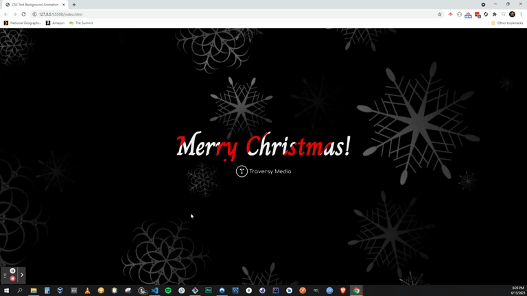

# HTML & CSS - CSS Text Background Animation

### About

A really quick project that animates the background image behind text and moves it in a way to give it a really cool animated effect.

### New Stuff

```
background-clip: text;
```

```
animation: moveBg 90s linear infinite;
```

```
@keyframes moveBg {
  0% {
    background-position: 0% 30%;
  }

  100% {
    background-position: 100% 50%;
  }
}
```



### Thanks

Thanks to Traversy Media for another amazing tutorial.
